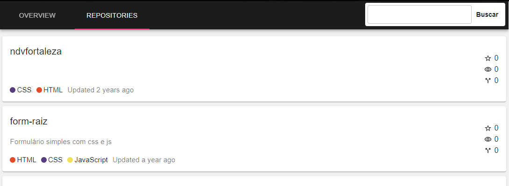

<h1 align="center">Github Profiles</h1>

<h4 align="center">Busque por usuários do Github e seus repositórios</h4>

## Sobre
O projeto <strong>Github Profiles</strong> é um buscador de usuários que foi criado a partir de um desafio enviado pela [Resolvvi](https://www.resolvvi.com/).

## Tecnologias

Este projeto foi desenvolvido com:

- [ReactJS](https://pt-br.reactjs.org/)
- [React Router DOM](https://reactrouter.com/web/guides/quick-start)
- [GraphQL](https://graphql.org/learn/)
- [Material UI](https://material-ui.com/pt/)
- [VS Code](https://code.visualstudio.com/)

## Implantação
Deploy automático através do [Github Actions](https://github.com/features/actions) para o [Amazon S3](https://aws.amazon.com/pt/s3/)

<h1 align="center">
  
</h1>

<h1 align="center">
  
</h1>

<h1 align="center">
  
</h1>